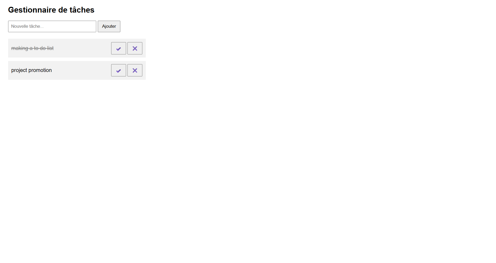

# Task Manager (To-Do List) 📝

An interactive, user-friendly web application designed to help users track and manage their daily tasks efficiently, built using **jQuery** to streamline DOM manipulation and animations.

## 🛠️ Key Features
- **Dynamic Task Creation:** Add new items to the task list instantaneously using jQuery selectors and form inputs.
- **Interactive State Tracking:** Smoothly toggle task completion status and strike through finished items using jQuery event handlers.
- **Efficient DOM Deletion:** Seamless removal of completed tasks directly from the interface view with clean jQuery traversal methods.

## 🚀 Technologies Used
- **Frontend Framework/Library:** jQuery (JavaScript Ecosystem)
- **Structure & Styling:** HTML5 / CSS3
- **Core Concepts:** Event handling (`.on()`), dynamic DOM insertion (`.append()`), element removal (`.remove()`), and input value handling.

---

## 📸 Interface Preview
Visual preview of the dynamic task management application and state toggles:

